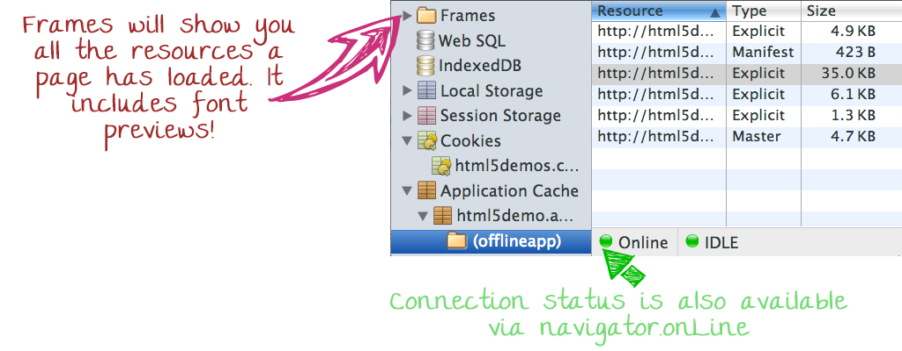
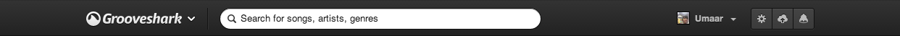
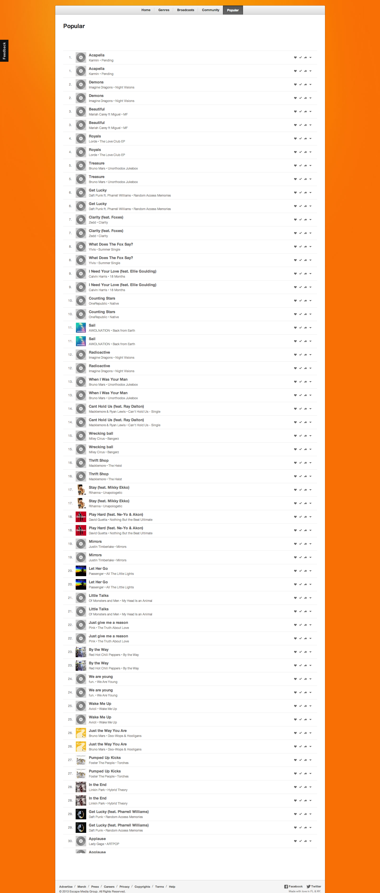
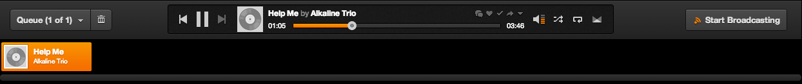

title: Who am I?
class: big

* I'm a front-end web developer working at Shazam
* We're hiring for many engineering-based roles.
* "There is cake in the kitchen"
* GDE 

---

title: Elements panel
subtitle: Inspecting the DOM
class: segue dark nobackground

---

class: fill elements-panel-full-view nobackground

---

title: Elements panel
class: big

<ul class="build fade">
  <li>
    
    Viewing font! information in the computed pane
    
    <pre class="prettyprint" data-lang="css">
    span {
      <b>font-family: 'Lily Script One', Arial, Cursive;</b>
    }
    </pre>
  </li>
  <li class="slide-force-element-state">Force element state indicators</li>
  <li>Pseudo elements as their own nodes</li>
  <li>Cmd + Click for Selectors, properties and their values</li>
  <li>
    Inspect Shadow DOM
    <audio controls="controls">
      <source src="audio/sample.mp3" type="audio/mp3">
    </audio>
  </li>

</ul>

<aside class="note">
  <section>
    <ul>
      <li>$0.remove() for pseudo elements</li>
    </ul>
  </section>
</aside>

<footer class="source">
  <a href="http://updates.html5rocks.com/2013/09/DevTools-answers-What-font-is-that">DevTools answers: What font is that?</a>
</footer>

---

title: Resources
subtitle: Persistent storage
class: segue dark nobackground

---

class: fill resources-panel-full-view nobackground

---

title: Resources panel
class: big

* Cookies (clear them if needed)
* Application Cache (is a douchebag)
* Local & Session storage
* Web SQL & IndexedDB

<aside class="note">
  <section>
    <ul>
      <li>Clearing cookies</li>
      <li>Lily Script font preview</li>
    </ul>
  </section>
</aside>

<footer class="source">
  <a href="https://speakerdeck.com/jaffathecake/application-cache-douchebag">Appcache: Douchebag</a>
</footer>

---

title: Sources panel
subtitle: Code editing
class: segue dark nobackground

---

class: fill sources-panel-full-view nobackground

---

title: Sources panel
class: big

<ul class="build fade">
  <li>Workspaces &amp; Code editing</li>
  <li>Less Source Maps (<a href="http://umaar.github.io/bootstrap-source-map-example/">Bootstrap example</a>)</li>
  <li>Snippets (<a href="https://github.com/bgrins/devtools-snippets/blob/master/snippets/allcolors/allcolors.js">Colours example</a>)</li>
  <li>Local modifications</li>
</ul>

<aside class="note">
  <section>
    <ul>
      <li>Cmd + o for custom.css will = 2 results: map to network resource.</li>
      <li>project search: todo, ignore node_modules</li>
      <li>red.css: &lt;link href="theme/css/red.css" rel="stylesheet"/&gt;</li>
      <li>Possible need to 'Save as' for a file so DevTools has write permission.</li>
      <li>Cmd + / = unchecked style in styles pane</li>
      <li>brace matching, keyword matching based on selected text. Styles panel -> sources panel.  </li>
      <li>CSS pretty print.</li>
      <li>Increment val in sources.</li>
    </ul>
  </section>
</aside>

---

title: Layers panel
subtitle: Layer promotion
class: segue dark nobackground

---

class: fill layers-panel-full-view nobackground

---

title: Layers panel
subtitle: What is a layer?
class: big

<ul class="build fade">
  <li>A portion of the page uploaded to the GPU for compositing.</li>
  <li>Reasons include:</li>
  <ul>
    <li>3D/perspective CSS properties</li>
    <li>Certain video/canvas elements</li>
    <li>A few more which can change at any time</li>
  </ul>
</ul>

<aside class="note">
  <section>
    <ul>
      <li><a href="http://www.webkit.org/blog-files/3d-transforms/poster-circle.html">Nice layers demonstration</a></li>
      <li>Beware of putting too many things into layers - this eats up graphics memory</li>
      <li><a href="http://codepen.io/ariya/full/xuwgy">CodePen demo</a></li>
    </ul>
  </section>
</aside>

---

title: Layers panel continued
subtitle: How to use the Layers panel
class: big

<ul class="build fade">
  <li>Currently an <strong>experimental feature</strong>.</li>
  <li class="slide-layer-promotion">I should be promoted to a layer.</li>
  <li>Element dimensions, memory estimates, reasons for compositing and more.</li>
  <li>Show composited layer borders</li>
</ul>

<aside class="note">
  <section>
    <ul>
      <li>Show composited layer borders is a simplistic view of the layers panel</li>
    </ul>
  </section>
</aside>

---

title: Extra bits

A few extra bits and pieces to quickly touch upon:

* Flamecharts
* Timeline panel
* New column headers in the network panel
* getEventListeners(document.body)

---

title: Before &amp; after reaction of discovering new DevTools features

<article class="flexbox vcenter">

  <h3>Before</h3>
  

  <h3>After</h3>
  

</article>

---

title: Elements panel: recap

---

title: Elements panel: recap

---

title: Resources panel: recap

---

title: Sources panel: recap
subtitle: Create and edit new files

<video class="slide-video" src="videos/workspaces-new-file.mp4" loop="true" autoplay="true"></video>

---

title: Sources panel: recap
subtitle: Commented out styles: toggled off in Styles & persisted to disk

<video class="slide-video medium-video" src="videos/sources-commenting.mp4" loop="true" autoplay="true"></video>

---

title: Sources panel: recap
subtitle: Pretty print minified CSS and JavaScript

<video class="slide-video medium-video" src="videos/source-css-pretty-print.webm" loop="true" autoplay="true"></video>

---

title: Sources panel: recap

---

title: Layers panel: recap

<video class="slide-video" src="videos/layers-panel.mp4" loop="true" autoplay="true"></video>

---

title: Layers panel panel: recap

---

title: Layers panel: recap
subtitle: <a href="http://grooveshark.com/#!/popular">Grooveshark example</a>

<button onclick="document.getElementById('gs-rotationContainer').classList.toggle('gs-rotated');">Twist</button>

  

    

      

    

    
    
    
    
    
  

